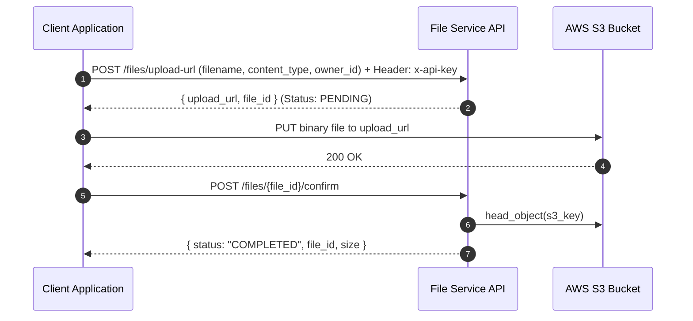

# Internal File Service API

A centralized FastAPI microservice for managing file uploads, downloads, and storage metadata built on top of AWS S3 and PostgreSQL/SQLAlchemy.

---

## 🏗️ Architecture & Upload Flow

To avoid passing heavy file streams through the API server, this service uses **AWS S3 Presigned URLs**.



---

## 🔑 Authentication

All endpoints require the HTTP header:
```http
x-api-key: YOUR_APP_API_KEY
```
This key identifies the consuming application and enforces multi-tenant data isolation.

---

## 📡 API Endpoints

### 1. Request Upload URL
* **`POST /files/upload-url`**
* **Request Body**:
  ```json
  {
    "filename": "document.pdf",
    "content_type": "application/pdf",
    "owner_id": "user_123"
  }
  ```
* **Response**:
  ```json
  {
    "upload_url": "https://myapp-files-prod-wask.s3.amazonaws.com/...",
    "file_id": 42
  }
  ```

### 2. Confirm Upload Success
* **`POST /files/{file_id}/confirm`**
* Verifies file existence on S3, populates file size, and sets status to `"COMPLETED"`.
* **Response**:
  ```json
  {
    "status": "COMPLETED",
    "file_id": 42,
    "size": 1048576
  }
  ```

### 3. Generate Presigned Download URL
* **`GET /files/{file_id}/download-url?expires_in=300`**
* **Response**:
  ```json
  {
    "download_url": "https://myapp-files-prod-wask.s3.amazonaws.com/...",
    "filename": "document.pdf"
  }
  ```

### 4. List Files
* **`GET /files?owner_id=user_123&status=COMPLETED&limit=50&offset=0`**
* **Response**:
  ```json
  {
    "total": 1,
    "limit": 50,
    "offset": 0,
    "files": [
      {
        "id": 42,
        "s3_key": "app_id/uuid-document.pdf",
        "original_filename": "document.pdf",
        "owner_id": "user_123",
        "content_type": "application/pdf",
        "size": 1048576,
        "status": "COMPLETED",
        "uploaded_at": "2026-07-22T19:27:00+00:00"
      }
    ]
  }
  ```

### 5. Get File Metadata
* **`GET /files/{file_id}`**

### 6. Delete File
* **`DELETE /files/{file_id}`**
* Removes object from S3 and deletes the metadata record from database.

---

## ⚡ Running locally

```bash
# Activate virtual environment
.\venv\Scripts\activate

# Run dev server
uvicorn main:app --reload
```
